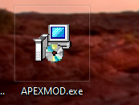
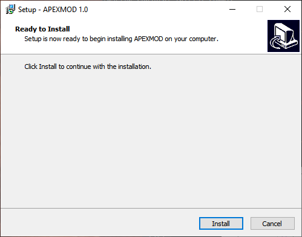
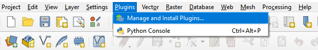
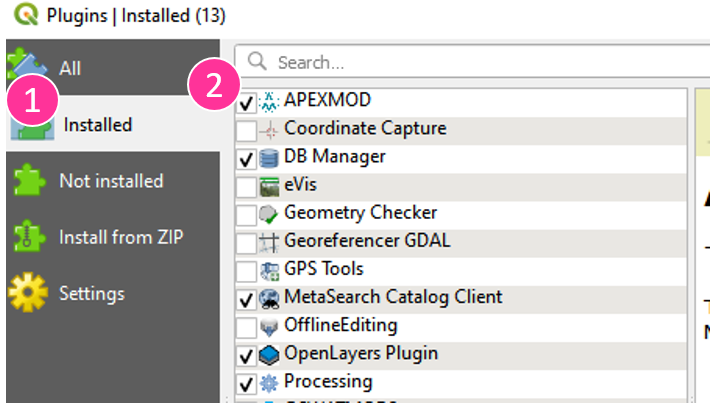
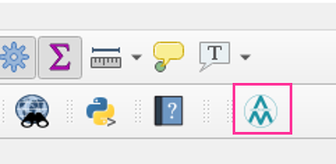

#  &nbsp; APEXMOD

#### :exclamation: ***Note:*** `APEXMOD is compatible with QGIS3.`

APEXMOD is a QGIS-based graphical user interface that facilitates linking [APEX](https://epicapex.tamu.edu/apex//) and [MODFLOW](https://www.usgs.gov/mission-areas/water-resources/science/modflow-and-related-programs?qt-science_center_objects=0#qt-science_center_objects), running APEX-MODFLOW simulations, and viewing results.  

This repository contains source codes and an executable for APEXMOD.
- __[Installer](https://github.com/spark-brc/APEXMOD/releases/download/v1.5.1/APEXMOD.exe):__ APEXMOD 1.5.exe
- **[Inputs](https://github.com/spark-brc/APEXMOD/releases/download/v1.4.3/apexmod_data.zip):** Animas Dataset zip file
- **[Salt_Test_Dataset](https://github.com/spark-brc/APEXMOD/releases/download/v1.3.1/APEXMOD_salt_test.zip):** Price Dataset zip file
- **[Source Code](https://github.com/spark-brc/APEXMOD/tree/master/APEXMOD)**
- **[Tutorial Document (example)]()** will be provided soon!

-----
#  &nbsp; Installation
The QGIS3 software must be installed on the system prior to the installation of APEXMOD. We've tested APEXMOD with the “long term release (LTR)” (3.28.12) and "latest release (RC)" (3.34.0) versions of QGIS3 (long term release version recommended). Download the [QGIS](https://www.qgis.org/en/site/forusers/download.html)

- Install one of the versions of QGIS. It can be downloaded from https://qgis.org/en/site/forusers/download.html.
- Download [the APEXMOD installer](https://github.com/spark-brc/APEXMOD/releases/download/v1.5.1/APEXMOD.exe) and install it by running APEXMOD 1.0.exe or a later version. The APEXMOD is installed into the user's home directory *(~\AppData\Roaming\QGIS\QGIS3\profiles\default\python\plugins\APEXMOD)*, which we will refer to as the APEXMOD plugin directory.

    

    

APEXMOD includes all dependencies ([FloPy](https://www.usgs.gov/software/flopy-python-package-creating-running-and-post-processing-modflow-based-models) ([Bakker et al., 2016](https://onlinelibrary.wiley.com/doi/abs/10.1002/hyp.10933)) and [PyShp](https://pypi.org/project/pyshp/)) directly in the plugin to avoid user-installation.  
- Open QGIS3 after the installation of APEXMOD is finished.

If you don't see APEXMOD icon on the toolbar,
- Go to Plugins menu and open Manage and Install Plugins

    

- Click the installed tab and check APEXMOD box to activate the plugin.

    

Now, you will see the APEXMOD icon on the toolbar.

    

 

# References
[Park, S., Jeong, J., Motter, E., and Bailey, R (2023). Introducing APEXMOD, A QGIS plugin for application and evaluation for the Enhanced APEX model, Environmental modelling & software. 165, 105723. 10.1016/j.envsoft.2023.105723](https://doi.org/10.1016/j.envsoft.2023.105723)
